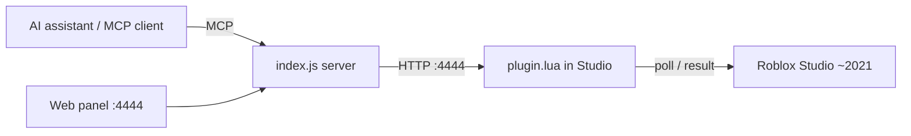

<div align="center">


# Korone Studio (2021M) MCP

**An MCP bridge that lets AI assistants control Roblox Studio 2021 in real time**


</div>

## Features

- **MCP protocol** — speaks the Model Context Protocol, so any MCP-compatible AI assistant can talk to Studio directly.
- **Web control panel** — a built-in dashboard at `http://127.0.0.1:4444` to run tools, browse results and manage connected Studio clients.
- **30+ tools** — from `read_workspace` and `create_instance` to `execute_lua`, `set_lighting` and tagging.
- **Dot-path notation** — address instances as `Workspace.Bridge.Part` instead of fighting slash paths.
- **Multiple clients** — several Studio windows can connect at once; each gets its own toggle, and you can target a specific one (click its chip in the panel, or pass `client` to any tool from an MCP client)
- **Hot reload** — while developing, edit `plugin.lua` and the plugin picks the changes up in seconds.

## Architecture



## Requirements

- **Node.js 18+**
- **Roblox Studio 2021** — any 2021M-era build
- The plugin file `plugin.lua` loaded into Studio

## Installation

1. Install dependencies and start the server:

   ```bash
   npm install
   npm start
   ```

2. Open `http://127.0.0.1:4444` in a browser to reach the web panel.
3. In Studio, load `plugin.lua` as a plugin (Plugins folder or drag-and-drop into Studio).
4. The panel should switch to **connected** and the small `MCP: checking...` widget appears in the corner.

## Configuration

Settings are stored per-user via `plugin:SetSetting` and can be changed from the plugin panel.

| Setting | Default | Description |
|---|---|---|
| `MCP_ServerURL` | `http://127.0.0.1:4444` | Base URL of the bridge server |
| `MCP_ClientName` | `studio` | Client key shown on the web panel |
| `MCP_Enabled` | `true` | Master switch for the plugin |
| `MCP_PollInterval` | `0.3` | Seconds between HTTP polls |
| `MCP_ShowStatusWidget` | `true` | Show/hide the small `MCP: checking...` widget |
| `MCP_StatusCheckInterval` | `2` | Seconds between status pings to the panel |
| `MCP_VerboseLogging` | `false` | Extra logging in the Studio output |

## Path notation

Instances are addressed with **dot notation**:

```
Workspace.Bridge.Part
Workspace.Models.Car.Body
```

Slash notation (`Workspace/Bridge/Part`) is also accepted for compatibility.

## Studio compatibility

Designed for 2021-era Roblox Studio builds (like 2021M). Things to keep in mind:

- **Old `HttpService`** — only two-argument calls are safe: `GetAsync(url)` and `PostAsync(url, body)`. Extra arguments (headers, content type) are **not** supported and fail silently.
- **ASCII-only strings** — non-ASCII characters in the Lua source (like `—` or `═`) turn into mojibake (`—`) in logs. The plugin keeps its strings ASCII.

## HTTP endpoints

| Endpoint | Method | Purpose |
|---|---|---|
| `/hello` | POST | Plugin registers itself with the server |
| `/poll` | GET | Plugin asks for pending tool calls |
| `/result` | POST | Plugin returns a tool result |
| `/status` | GET | Health/status of the server |
| `/log` | POST | Plugin forwards Studio log lines |
| `/call` | POST | Run a tool from the web panel |
| `/client-toggle` | POST | Enable/disable a specific client by key |
| `/plugin-update` | GET | Hot-reload source for the plugin |

## Usage

1. Start the server (`npm start`) and load the plugin into Studio.
2. Open the web panel at `http://127.0.0.1:4444`.
3. Pick a tool, fill in its arguments (placeholders show examples), hit **Run →**.
4. The result appears in the panel; **Copy result** copies it to your clipboard.

Example: ask your MCP client to run `create_instance` with `parent=Workspace` and `className=Part`, then check `read_workspace` to see it.

With several Studio windows connected: click a client chip in the panel to target it (highlighted green), or pass `client: "studio"` to any tool from an MCP client. Without a target, the command goes to the only active client — or, if several are active, to the most recently active one.

## Troubleshooting

| Symptom | Fix |
|---|---|
| Panel says **checking...** forever | Make sure the server is running and `MCP_ServerURL` points at `http://127.0.0.1:4444`; check the Studio output for errors |
| `—` / mojibake in Studio logs | Non-ASCII characters in `plugin.lua` — replace them with ASCII (`-`, `=`) |
| Duplicate/ghost clients on the panel | Restart the server so stale registrations clear; each Studio window uses its own `?client=` key |

## License

MIT
</invoke>
